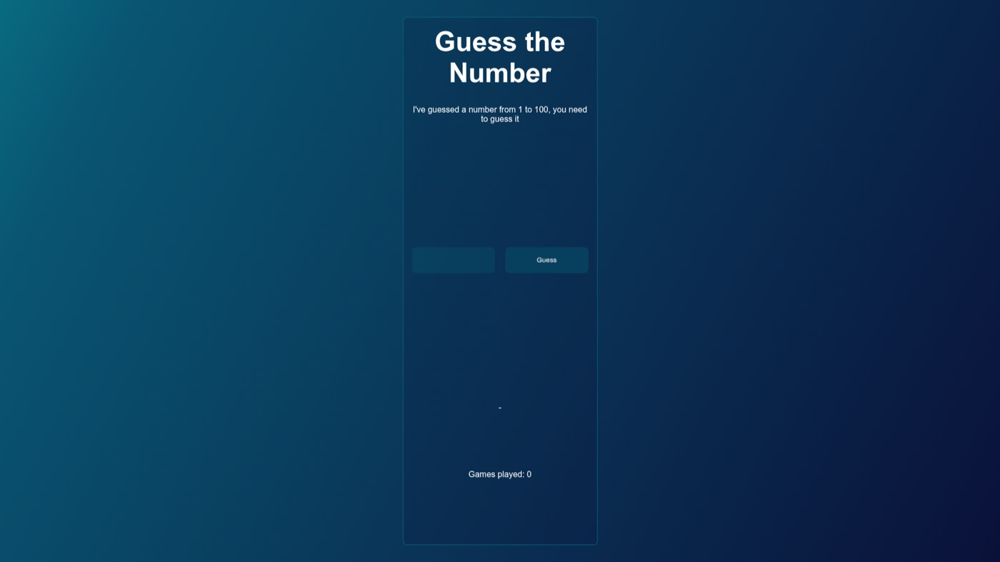

# Guess the Number

**A number-guessing game with graded hints — how few attempts do you need?**



**[Play it live →](https://anastacodes.github.io/GuessTheNumberGame/)**

## Features

- Guess the hidden number between 1 and 100
- Graded hints: "higher / lower" and "much higher / much lower" as you close in
- Attempt counter and one-click restart
- Keyboard support (type and hit Enter) with ARIA attributes for accessibility
- Built with vanilla HTML, CSS and JavaScript — no dependencies

## Run locally

```bash
git clone https://github.com/AnastaCodes/GuessTheNumberGame.git
open GuessTheNumberGame/index.html
```
